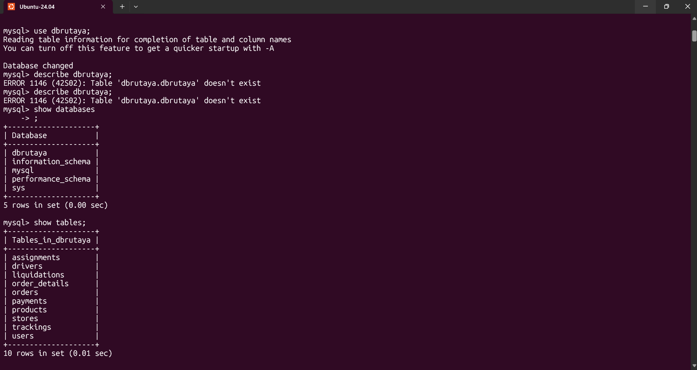
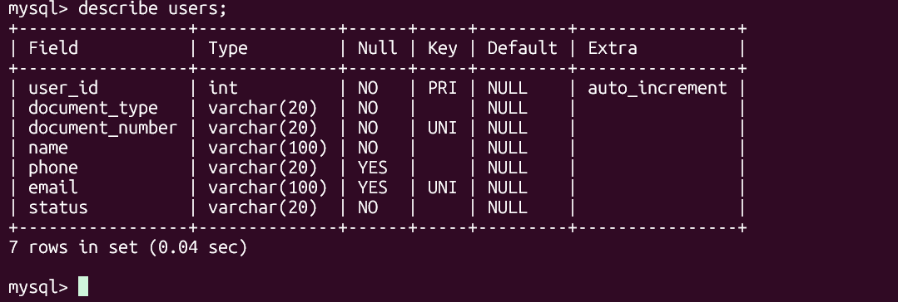
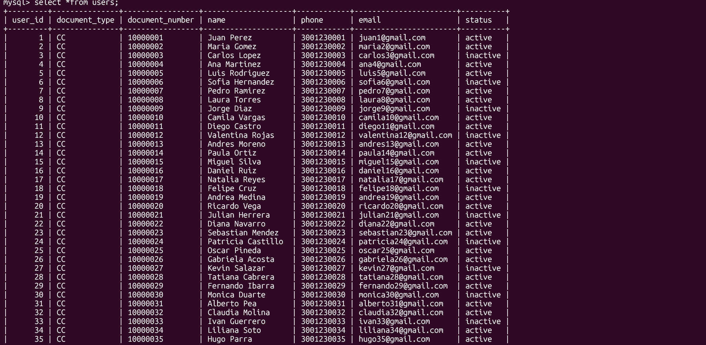
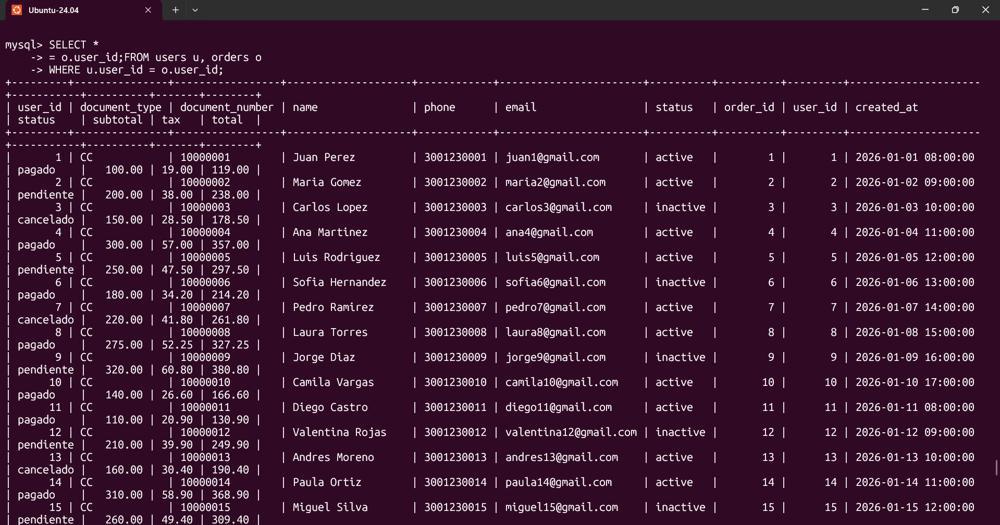

# CONSULTA MOTORES

### MySql

Cambiamos a la databases de dbrutaya, miramos las tablas de la data

usamos describ para ver los campos de users

miramos los datos de la tabla users

visualizamos la relacion entre users y orders

