# CONSULTAS AVANZADAS

## MySql Primera Consulta forma 1

En esta consulta se usan dos tablas (`users` y `orders`) en el `FROM`.\

Luego, en el `WHERE`, se hace la relación entre ambas usando `user_id`.\

También en el `WHERE` se agrega la condición para filtrar las ventas de una fecha específica.

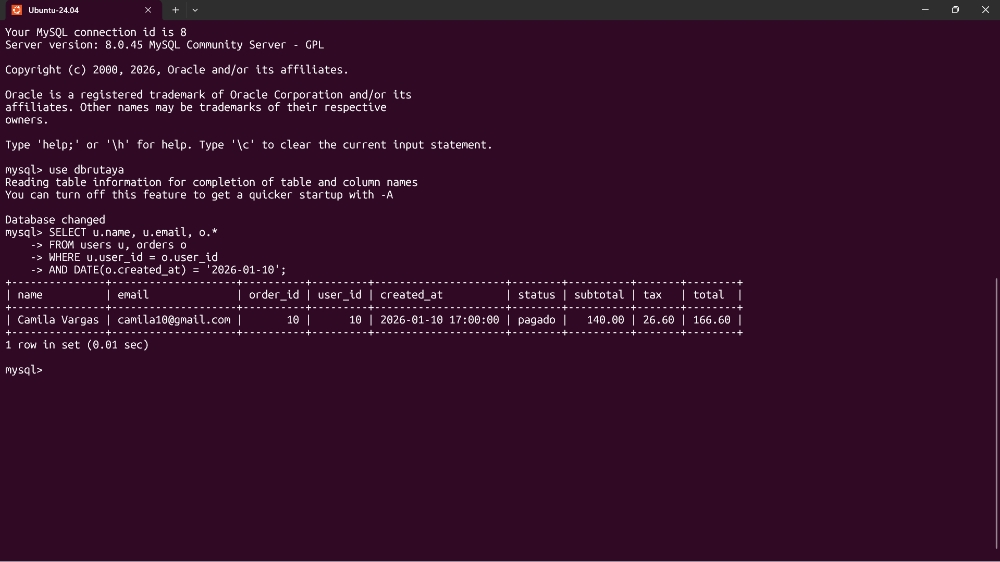

## MySql Primera Consulta forma 2

En esta consulta se usa `JOIN` para unir las tablas `users` y `orders` mediante `user_id`.\

La condición de la fecha se aplica con `WHERE`, filtrando las ventas de un día específico.\

Esta forma es más clara y es la recomendada en SQL moderno.

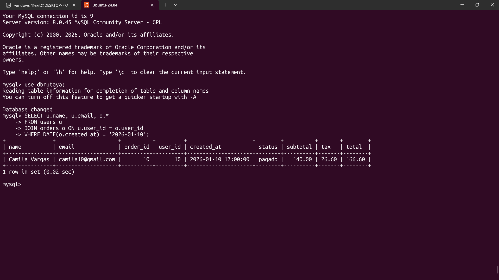

## MySql Segunda Consulta forma 1

En esta consulta se usan varias tablas en el `FROM`.\

Las relaciones entre `users`, `orders`, `order_details` y `products` se hacen en el `WHERE`.\

También se filtran las ventas en un rango de fechas con `BETWEEN` y se ordenan de forma ascendente por la fecha.

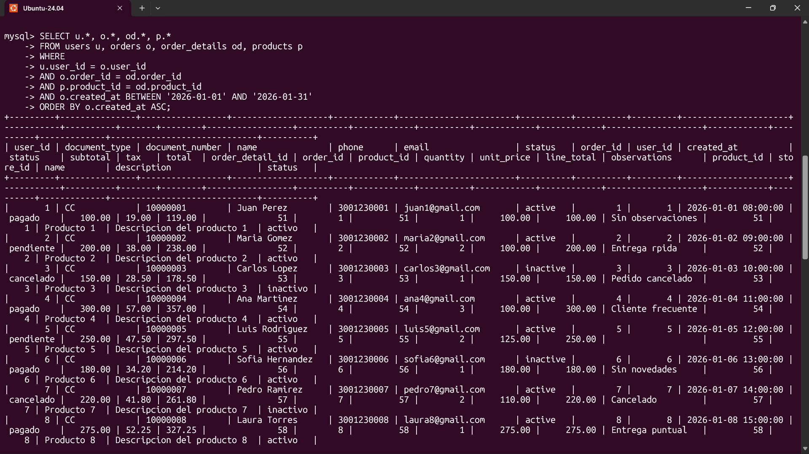

## MySql Segunda Consulta forma 2

En esta consulta se usan `JOIN` para unir las tablas siguiendo la relación entre ellas.\

Primero `users` con `orders`, luego con `order_details` y finalmente con `products`.\

Se usa `WHERE` para filtrar las ventas en un rango de fechas y `ORDER BY` para ordenarlas de forma ascendente.

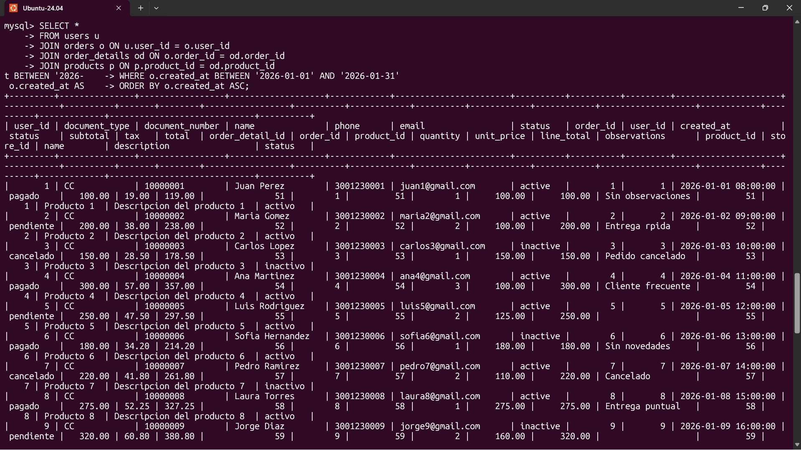

## MySql Tercera Consulta forma 1

En esta consulta se usan las tablas `users` y `orders` en el `FROM`.\

La relación entre cliente y venta se hace en el `WHERE`.\

Luego se filtra por un rango de fechas con `BETWEEN`.\

Se agrupan los resultados por cliente (`GROUP BY`) para poder aplicar funciones como `SUM`, `COUNT` y `AVG`.\

Finalmente se ordena de mayor a menor según el total de ventas.

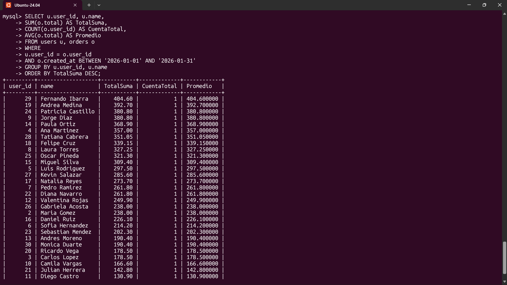

## MySql Tercera Consulta forma 2

En esta consulta se usa `JOIN` para unir `users` con `orders` mediante `user_id`.\

Se filtran las ventas en un rango de fechas.\

Luego se agrupa por cliente para calcular la suma, cantidad y promedio de sus compras.\

Finalmente se ordena el resultado por el total de ventas en orden descendente.

## 

## MySql Cuarta Consulta forma 1

En esta consulta se relacionan `users` y `orders` en el `WHERE`.\

Se filtran las ventas por rango de fechas.\

Luego se agrupa por cliente (`GROUP BY`) para calcular suma, cantidad y promedio.\

La cláusula `HAVING` se usa para mostrar solo los clientes que tienen **1 o más compras**.\

Finalmente se ordena por el total de ventas.

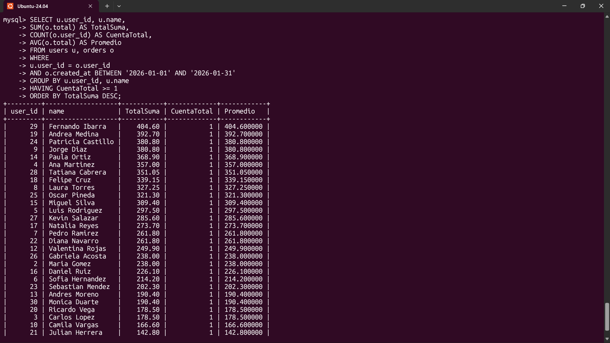

## MySql Cuarta Consulta forma 2

En esta consulta se usa `JOIN` para unir `users` con `orders`.\

Se filtran las ventas por fecha con `WHERE`.\

Luego se agrupa por cliente para aplicar funciones agregadas.\

`HAVING` permite filtrar los resultados agrupados, mostrando solo clientes con al menos 1 compras.\

Finalmente se ordena por el total de ventas.

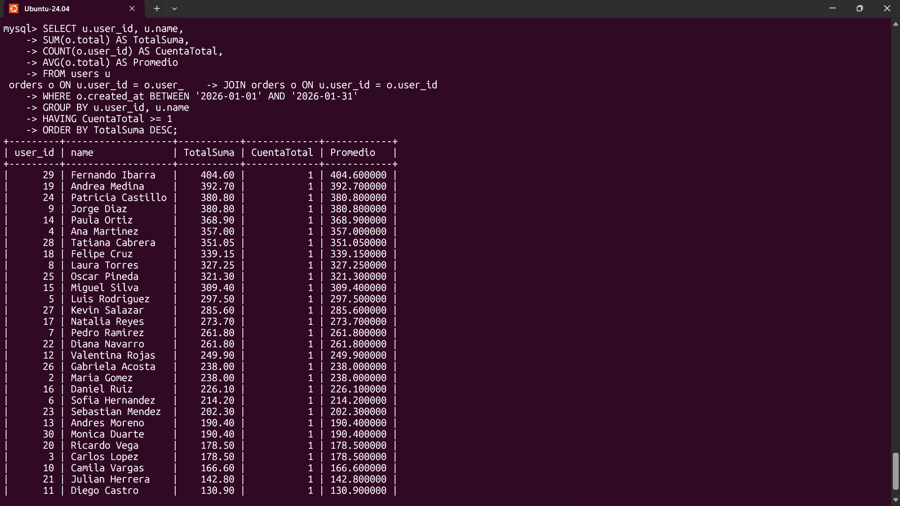

## MySql Quinta Consulta forma 1

Esta consulta usa una subconsulta (`NOT IN`) para excluir los usuarios que sí tienen órdenes en ese rango de fechas.\

Primero se obtiene la lista de `user_id` que hicieron compras, y luego se muestran los usuarios que **NO están en esa lista**.

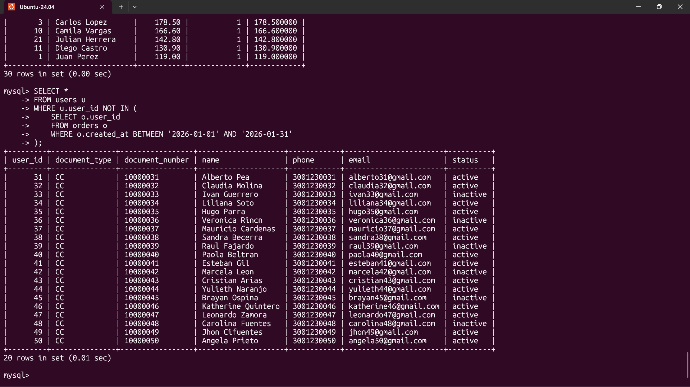

## MySql Quinta Consulta forma 2

Aquí se usa un `LEFT JOIN` para traer todos los usuarios, incluso si no tienen órdenes.\

Luego, con `WHERE o.user_id IS NULL`, se filtran solo los que **no tienen ventas en ese rango de fechas**.

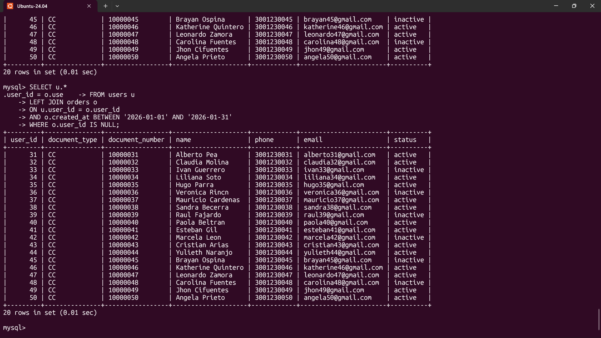

## PostgreSQL Primera Consulta forma 1

En esta consulta se incluyen ambas tablas en el `FROM`.\

La relación entre `users` y `orders` se hace en el `WHERE` usando `user_id`.\

Como hay 2 tablas, solo se necesita **1 relación** (tablas - 1).

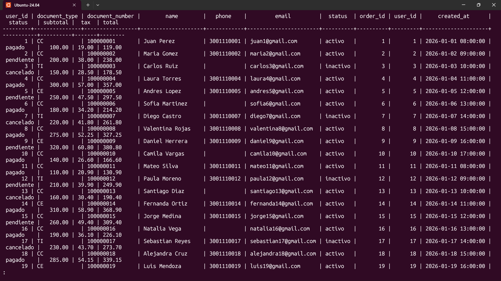

## PostgreSQL Primera Consulta forma 2

En esta consulta se usa `JOIN` para unir `users` con `orders`.\

La relación se define con `ON`, usando `user_id`.\

Esta forma es más clara y recomendada en SQL moderno.

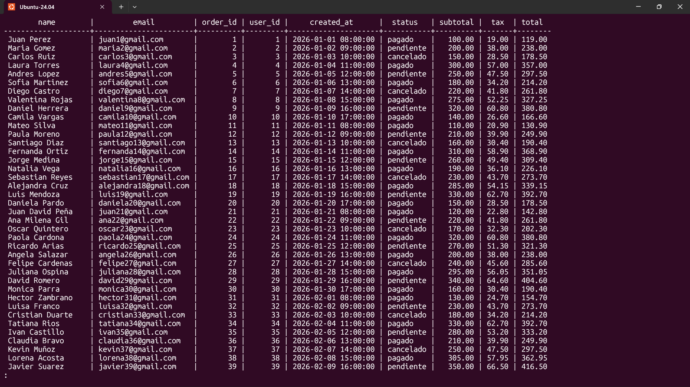

## PostgreSQL Segunda Consulta forma 1

Se usan las tablas `users` y `orders` en el `FROM`.\

La relación se hace en el `WHERE` con `user_id`.\

También en el `WHERE` se filtran las ventas de una fecha específica usando `DATE(created_at)`.

## PostgreSQL Segunda Consulta forma 2

Se usa `JOIN` para unir `users` con `orders`.\

La condición de la fecha se aplica con `WHERE`, filtrando las ventas de ese día.\

Esta forma es más clara y recomendada.

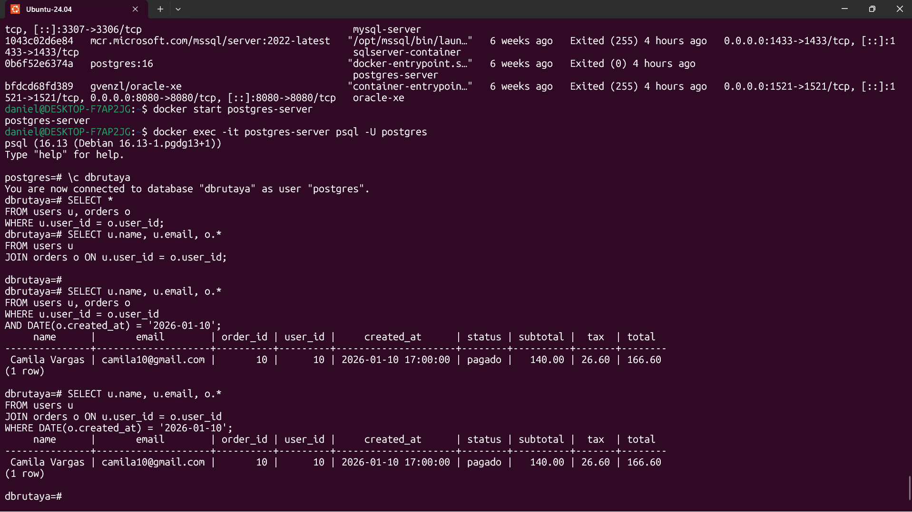

## PostgreSQL Tercera Consulta forma 1

Se usan todas las tablas en el `FROM`.\

Las relaciones se hacen en el `WHERE`, conectando `users → orders → order_details → products`.\

Se usa `BETWEEN` para filtrar por rango de fechas y `ORDER BY` para ordenar de forma ascendente.

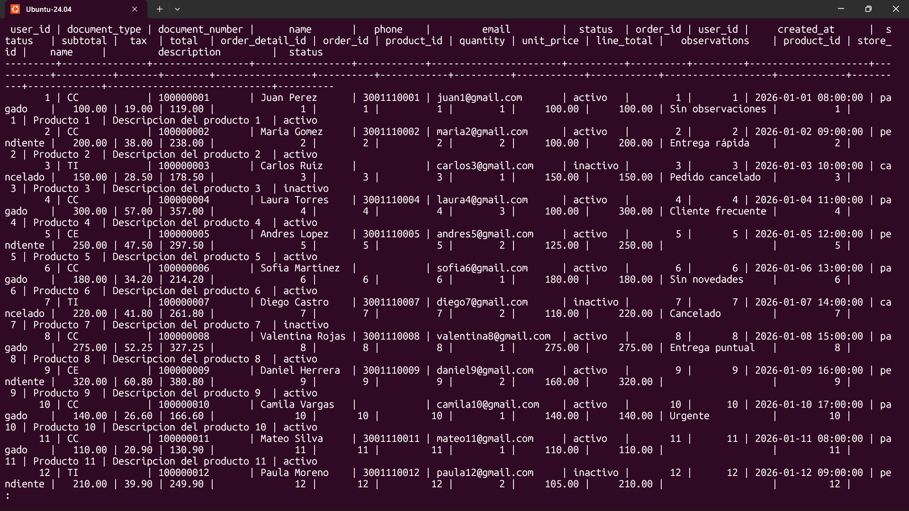

## PostgreSQL Tercera Consulta forma 2

Se usan `JOIN` para unir las tablas siguiendo la relación continua.\

Primero `users` con `orders`, luego con `order_details` y finalmente con `products`.\

Se filtran las ventas por fecha y se ordenan de forma ascendente.

## PostgreSQL Cuarta Consulta forma 1

Se usan `users` y `orders` en el `FROM`.\

La relación se hace en el `WHERE` con `user_id`.\

Se filtran las ventas por un rango de fechas.\

Luego se agrupa por cliente (`GROUP BY`) para aplicar funciones como `SUM`, `COUNT` y `AVG`.\

Finalmente se ordena de mayor a menor según el total de ventas.

## PostgreSQL Cuarta Consulta forma 2

Se usa `JOIN` para unir `users` con `orders`.\

Se filtran las ventas por fecha.\

Luego se agrupa por cliente para calcular la suma, cantidad y promedio de sus compras.\

Finalmente se ordena por el total de ventas en orden descendente.

## PostgreSQL Quinta Consulta forma 1
